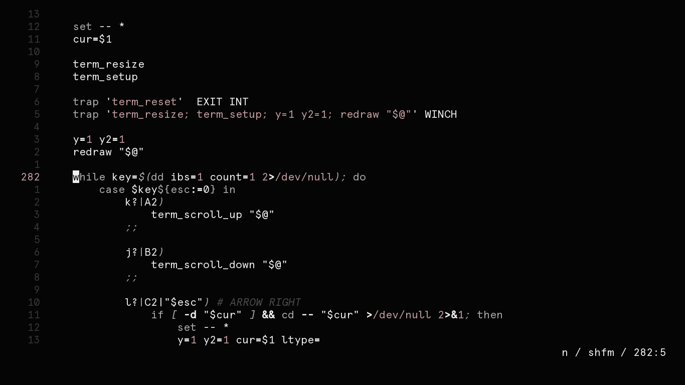

<h3 align="center">gunmetal.vim</h3>

A variant of Mountaineer that focuses on being less colorful and more simplistic

***

## Installation

Simply place the `gunmetal.vim` file inside your vim colors folder, which should be either `~/.vim/colors/` or `~/.config/nvim/colors`, and then set `colorscheme gunmetal` in your vim config file. There are no options to this colorscheme, it works great out of the box.
